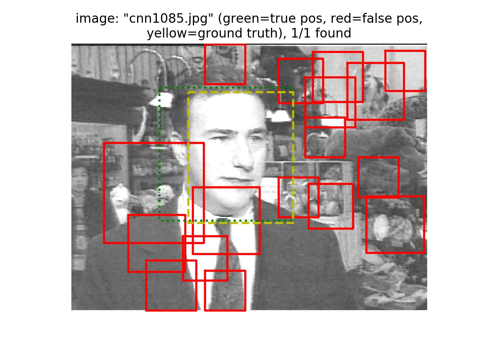
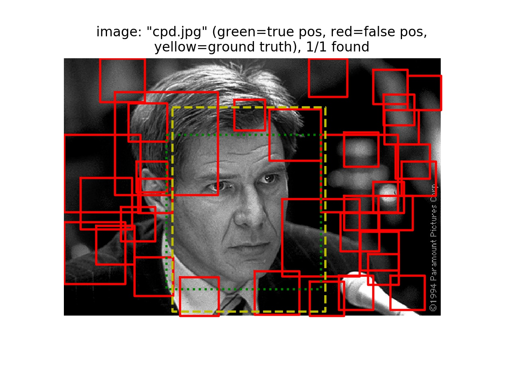
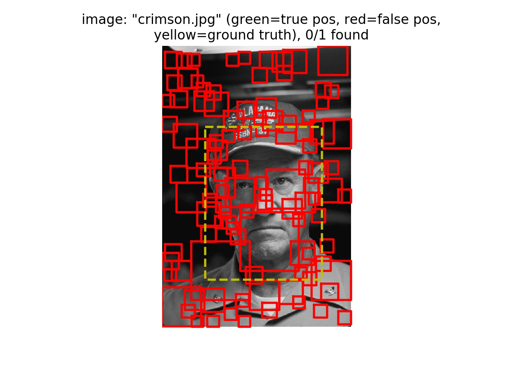
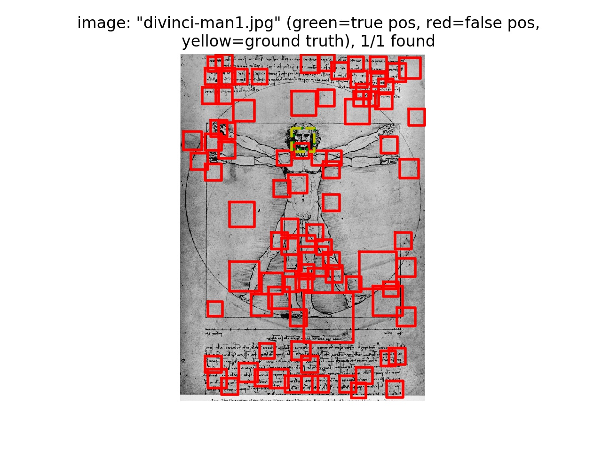
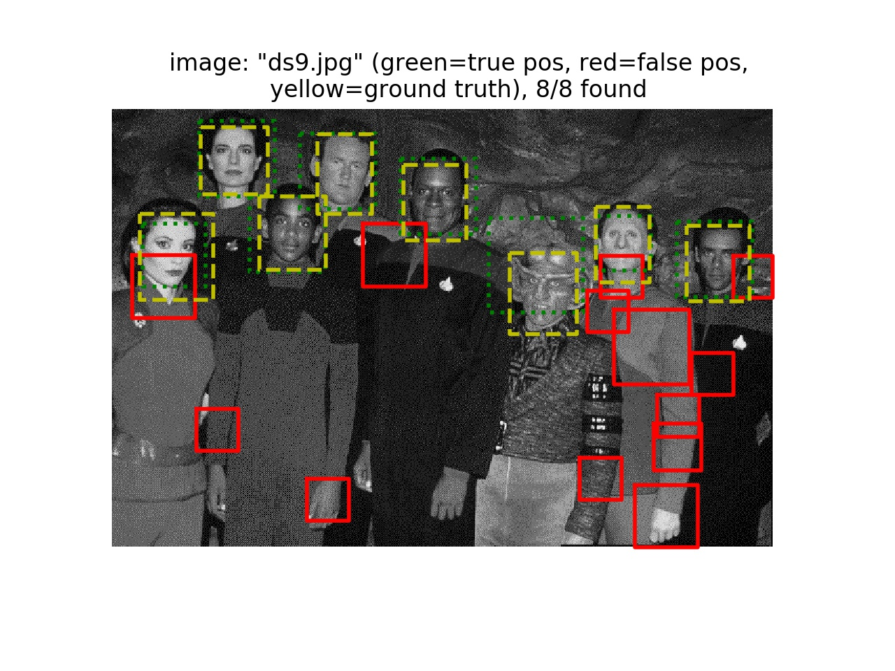
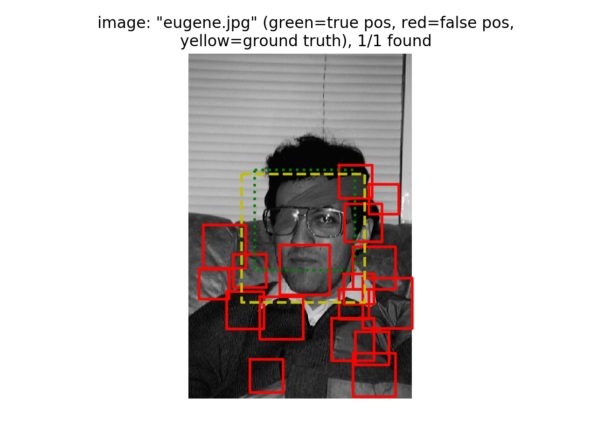
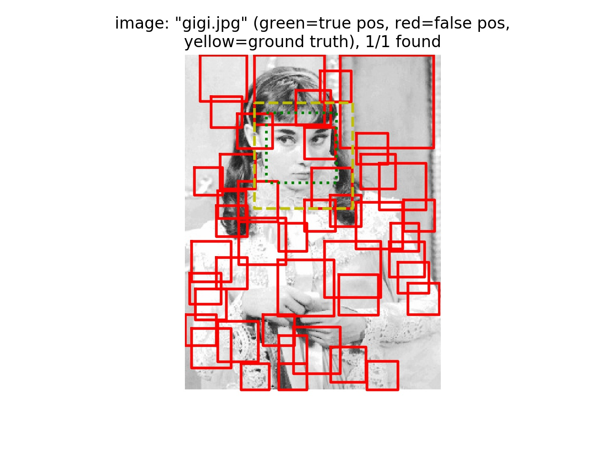
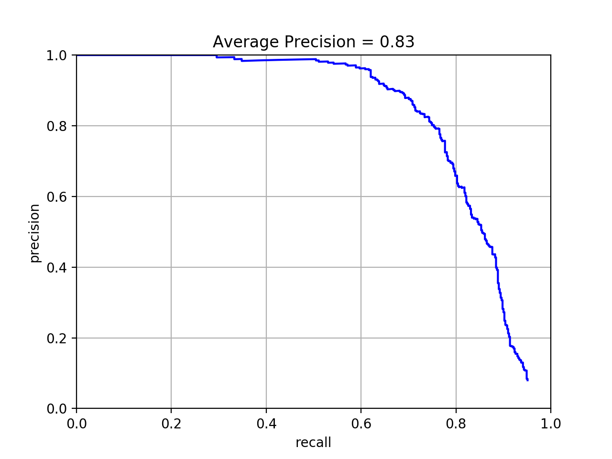

# 陳麒皓 <span style="color:red">(student ID : 106061516)</span>

# Project 4 / Face Detection with a Sliding Window

## Overview
The goal of this project is do face detection. In training part, we get positive and negative features (with face or without face) by histogram of gradients (HoG) and sliding window to train our classifier. In testing part, we get the features by the same ways and use the classifier to decide each bounding box in testing image whether it is face or not and record its location.

## Implementation
### Training part  
1. Gets face features (get_positive_features.py):  
  Use HoG function to convert image to Hog features with its cell size.
  ```
  for image_path in tqdm(os.listdir(train_path_pos)):
        image_path = os.path.join(train_path_pos, image_path)
        image = imread(image_path)
        features_pos.append(np.reshape(hog(image, hog_cell_size), -1))
  features_pos = np.array(features_pos)
  ```
2. Gets no face features (get_random_negative_features.py):  
  Read image with gray-scale, use pyramid-gaussian function to build training data with different scale and use sliding window method to build more templates.
  ```
  for image_path in os.listdir(non_face_scn_path):
        if image_path.find('.jpg') != -1:
            image_path = os.path.join(non_face_scn_path, image_path)
            images_path.append(image_path)

    for image_path in tqdm(images_path):
        im = imread(image_path, as_grey = True)
        im_pyramids = tuple(pyramid_gaussian(im))
        for im_pyramid in im_pyramids[:1]:
            num_sample_per_image =  num_samples // len(images_path) + 1
            if min(im_pyramid.shape[0], im_pyramid.shape[1]) <= template_size:
                break
            elif min(im_pyramid.shape[0], im_pyramid.shape[1]) < template_size + num_sample_per_image:
                num_sample_per_image =  min(im_pyramid.shape[0], im_pyramid.shape[1]) - template_size
            height_list = np.random.choice(im_pyramid.shape[0]-template_size, int(num_sample_per_image), replace = False)
            weight_list = np.random.choice(im_pyramid.shape[1]-template_size, int(num_sample_per_image), replace = False)
            for height, weight in zip(height_list, weight_list):
                features_neg.append(np.reshape(hog(im_pyramid[height : height + template_size, weight:weight + template_size], hog_cell_size), -1))

    features_neg = np.array(features_neg)
  ```
3. Classifier (svm_classify.py):  
  Build a linear SVM model for classification.
  ```
  clf = svm.LinearSVC()
  clf.fit(x, y)
  ```
### Testing part  
4. Detector (run_detector.py):  
  Detect face on different image scale [0.1 ~ 1.0]. Apply sliding window on Hog features. Set threshold to store the higher score examples.
 
  ```
  scale_arr = np.arange(1.0, 0, -0.1)
        for scale in scale_arr:
            img_resize = resize(img, [int(img.shape[0]*scale), int(img.shape[1] * scale)])
            test_image_hog = hog(img_resize, cell_size)
            for h in range(test_image_hog.shape[0] - cell_num + 1):
                for w in range(test_image_hog.shape[1] - cell_num + 1):
                    hog_window = np.reshape(test_image_hog[h:h + cell_num, w:w + cell_num, :], (1, -1))
                    score = model.decision_function(hog_window)
                    if score > -0.5:
                        min_y = int(h * cell_size / scale)
                        min_x = int(w * cell_size / scale)
                        max_y = int((h + cell_num) * cell_size / scale)
                        max_x = int((w + cell_num) * cell_size / scale)
                        
                        cur_confidence = np.array([score])
                        cur_image_id = np.array([[test_images[i]]])
                        cur_bbox = np.array([[min_x, min_y, max_x, max_y]])
                        
                        cur_bboxes = np.concatenate([cur_bboxes, cur_bbox], 0)
                        cur_confidences = np.concatenate([cur_confidences, cur_confidence], 0)
                        cur_image_ids = np.concatenate([cur_image_ids, cur_image_id], 0)
  ```

## Installation
* Other required packages   
  * skimage
  * cyvlfeat
  * sklearn
  * tqdm

* How to run the code&emsp;---&emsp;python proj4.py

### Results

<table border=1>
<tr>
<td>




</td>
</tr>

<tr>
<td>




</td>
</tr>

</table>


<center>
<p>
Face template HoG visualization  
<p>

<p>
Precision Recall curve  
<p>

<p>
</center>
